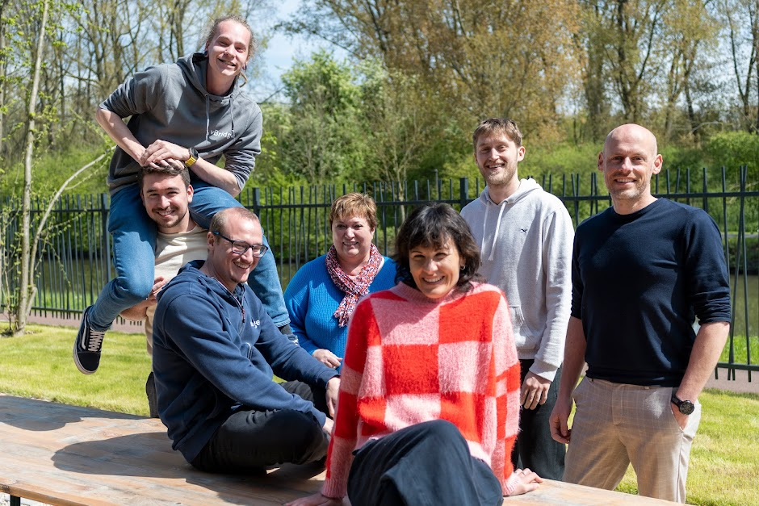
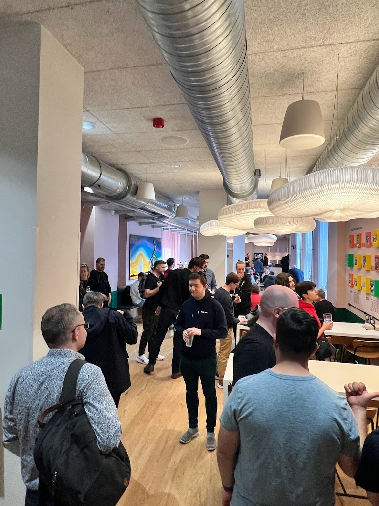
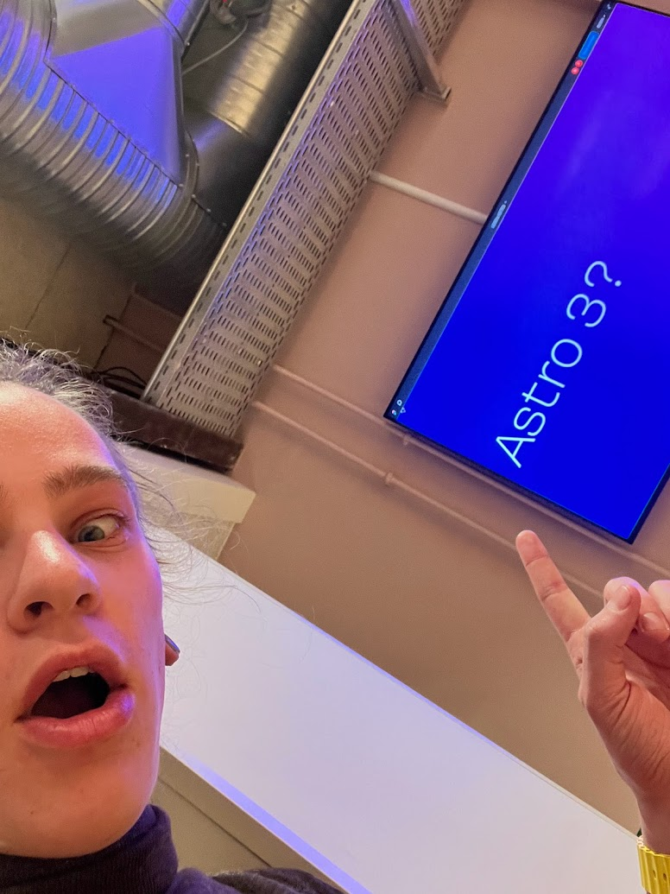
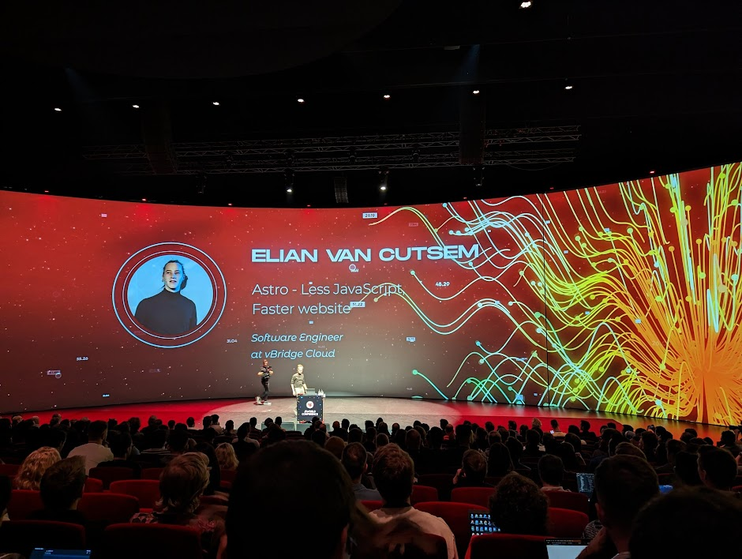

# So, I'm leaving vBridge

After spending a couple of years at [vBridge Cloud](https://www.vbridge.eu), I'm leaving the company. I've worked at vBridge as a software engineer eversince I graduated.

I had an amazing time there and learned a lot from each and every colleague. Thanks guys! For everything.

Now, it's time for a new adventure! I'm joining the DX-team at [Astro](https://astro.build) full-time! I'm so excited to be able to work on Astro full-time and help shape the future of web development!

After being nominated and selected as a maintainer for the project, this always felt like one of the next steps. You can read [the blogpost about becoming a maintainer here](https://www.elian.codes/blog/23-04-12-becoming-an-astro-maintainer/)

After being invited and flying out to Copenhagen to attend the first ever Astro meetup, where I met so many faces behind Astro, I knew that I wanted to stay involved with the project and help out where I could.

|  |  |
| --------------------------------------------------------------------------- | ------------------------------------------------------------------------------------------- |

## Team DX - Astro

The DX-team at Astro is something I've always resonated with. They are responsible for communication, welcoming new people and help them get started with Astro, keeping documentation updated and so much more!

One of my major tasks, will be the community! (In other words, you guys!)

Ranging from the weekly community calls, helping the support squad and reviewing and helping you guys make PRs!

(If you're interested in joining the Astro community, [join us on Discord](https://astro.build/chat))

Astro has given me so much, ranging from opportunities to travel the world, making new friends and learning so much about open source!

Let's change the future of web applications!

Interested to see what I'm doing? Follow me here:

- GitHub: [@ElianCodes](https://github.com/eliancodes)
- Twitter: [@eliancodes](https://twitter.com/eliancodes)
- Mastodon: [@eliancodes](https://webtoo.ls/@eliancodes)
