# 2023 - A year in review

2023 was such a rush for me, which is one of the reasons I’m only posting my recap this late. I feel like everything described in this blog post only happened yesterday. Maybe it’s because I work too hard or too much, or maybe it’s because I’ve done that many stuff the Elian from 2022 couldn’t believe I would ever do.

Up to you to figure that one out.

I hope you enjoy this blog post as much as I do, because man, what a crazy year. Let’s go for an even better and crazier 2024!

## First international conference

*February*

Where do I even begin, last year I finished my 2022 recap with a big look forward to my first international conference, and quicker than I could think about it, there it was. JSWorld in Amsterdam. JSWorld was such an amazing experience for me. It was my first international conference and the only one I was projecting on back in 2023, little did I know that I was going to speak at many many more that same year and I was so happy I got asked to speak in Amsterdam. Not only just my first international conference but also, I knew that Fred was going to be there. Not only one of the creators of Astro but also *The* CEO of HTML and CEO of The Astro Technology Company. The same company that powers the development of Astro, that same framework I was speaking about. I felt so scared and stressed to give a full 30-minute talk about Astro in front of one of the creators themselves.

After the talk was over, I was so overwhelmed with amazing comments and congratz from audience members, but also fellow speakers, including Fred. Best feeling ever, I lively remember Daniel Roe coming up to me and saying "Debbie told me this is your first full-length talk, I couldn't notice, you did amazing". I never felt so proud of myself before.

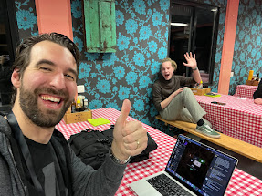
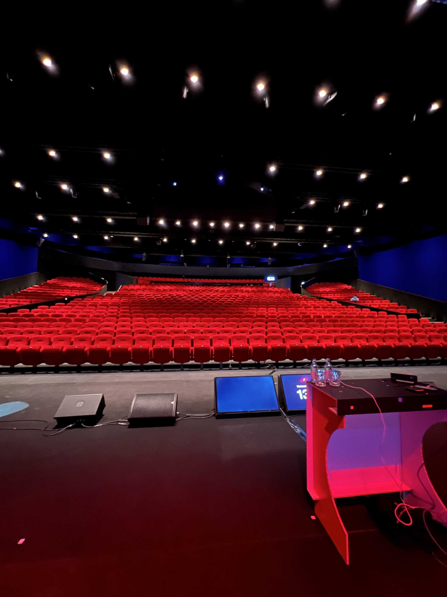
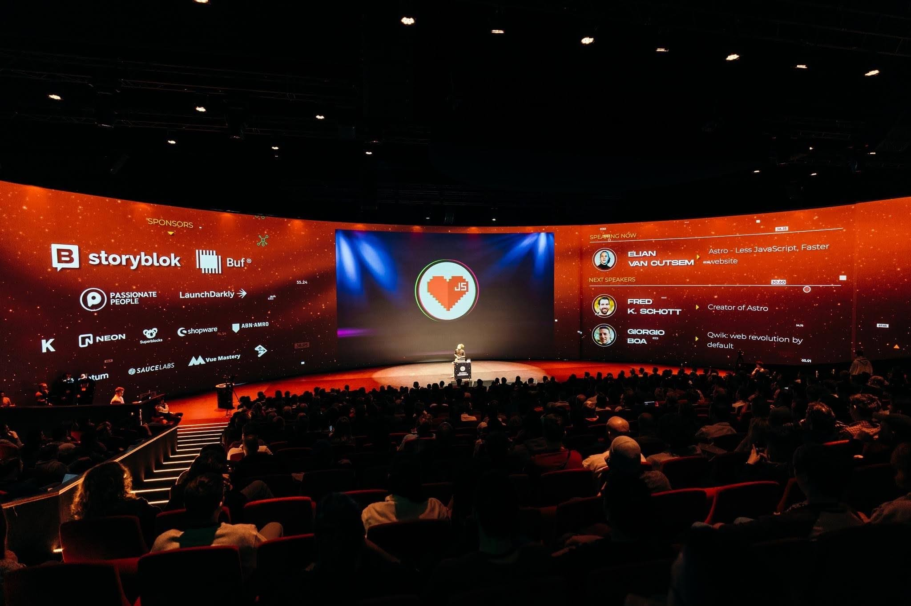

## Rebuilding my website and publishing a theme

*February*

While I was in the audience of the JSWorld and VueJS Amsterdam conference. I was overwhelmed by so many amazing speakers and contributors to big open-source projects, that I was thinking to myself WTF am I doing here… I'm just this small guy contributing some typo fixes in the Astro docs repo.
So I started, there on the spot, redesigning and re-developing my website from the ground up. Astro 2.0 just came out with content collections. So I started thinking about my new website, my new design, and everything. The result came out pretty cool. Eventually, I thought to myself, why shouldn’t I release this as a theme and open-source library myself? Maybe one day, this will be as big as Anthony open-sourcing the Nuxt dev tools on stage.

It’s not as big and never will nor has to be, but it gets me fun tweets like this:

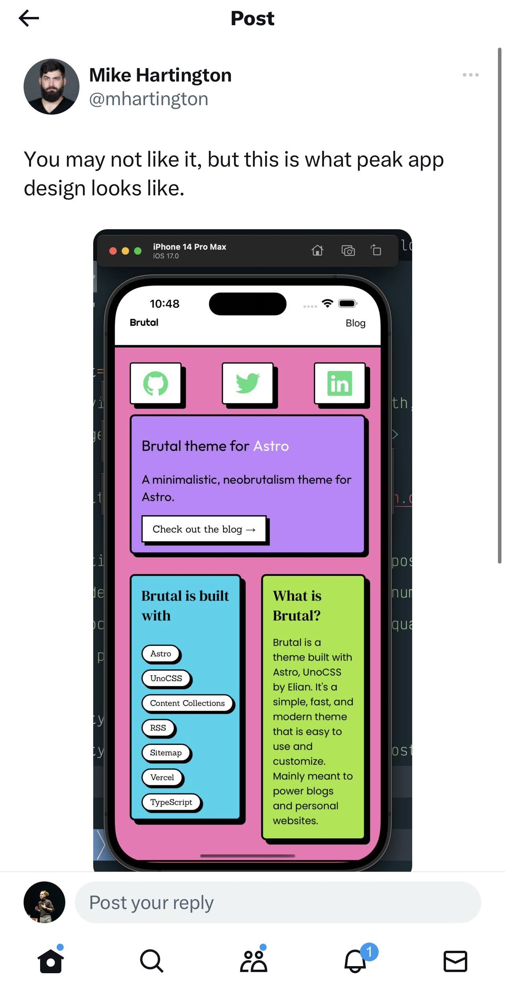

## Becoming Maintainer at Astro

*April*

I still even have a screenshot of the time I officially became a contributor. Which was already a crazy thing for me at that time (11oct 2021). Even though I regularly was contributing to Astro itself and Astro docs, a role like that, meant the world to me. Getting recognition for work that I love to do, was the best feeling ever.

In case you want to read more about [my thoughts on becoming a maintainer, you can read those here](/blog/23-04-12-becoming-an-astro-maintainer/).

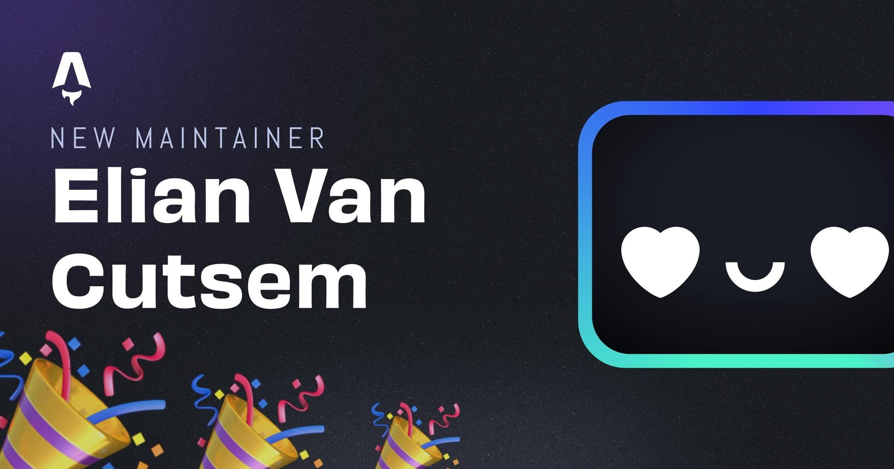

## Joining the Astro Offsite

*April*

This thing changed my life. And I’m pretty sure it changed the course of my career as well. After some core members weren't able to get their visas in time to come to Europe from America, I got the chance to join the Astro Offsite in Copenhagen. An amazing experience is the most I can say.

I got to meet almost all of Astro core, each one of them being amazing humans and put so much effort into including me in their activities and making sure I felt at home with them.

We had great fun and great conversations and I learned a lot about Astro.

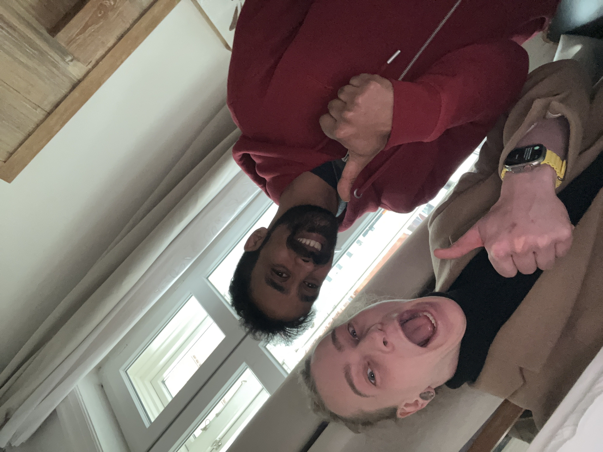

## BeJS

*May*

After speaking at React Brussels last year, getting to know Omar and Aymen on a personal level has been awesome. I always wanted to invest in the Belgian JavaScript ecosystem. They are doing amazing things and I’m glad that I get to be a small part of it. Even though I didn’t speak at the BeJS Conference, I decided to get involved with the BeJS team and try to help out where I could. Belgium is only a small European country, so being a friendly face in our small JavaScript community is something that I really value and am actively working towards.

Getting to meet the StackBlitz team and other people from around the world has been amazing, as usual.

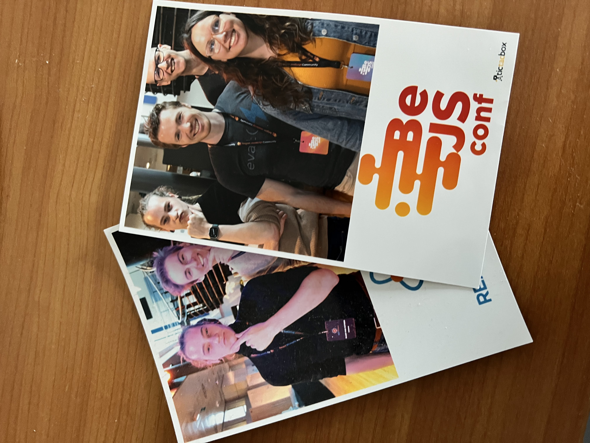

## RenderATL

*June*

I got the chance to go to America for the very first time in my life. So of course, I gladly took it. After some hassle and stress getting a visa to go there, I was so damn excited. Render was awesome. I got to meet so many people I've known for a while via social media for the very first time in person. We had such a great time and made so many memories. Many of whom I consider friends now.

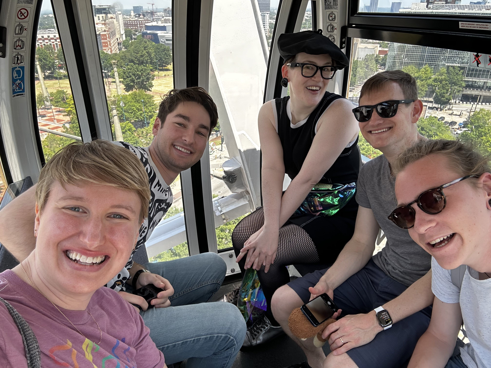
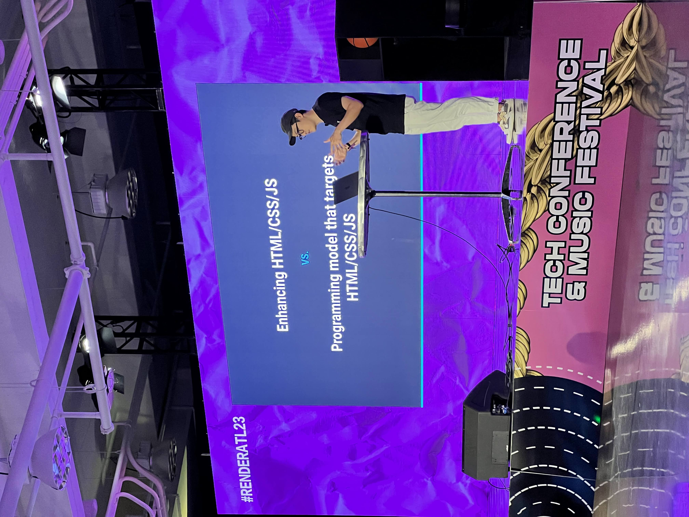
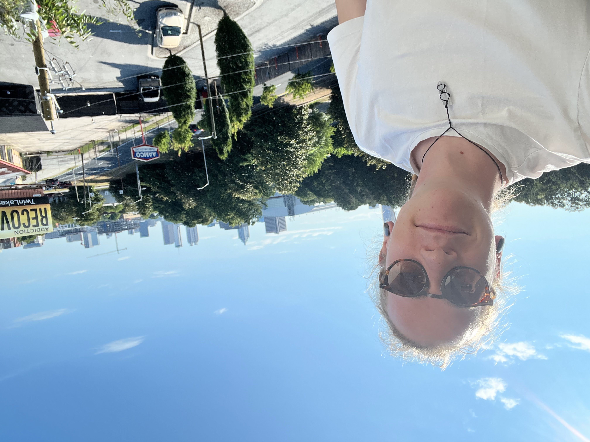

## Joining Astro Full-time

*August*

One day, I came home from work, opened my computer again to start working on some open source, and started my Discord. There it was, a message from Sarah (docs lead at Astro) inviting me to apply for an open role at Astro. Of course, there was nothing in this world I wanted more and I immediately applied. After a couple of days and some going back and forth, I got the word. "Elian, if you want, you have the job". I was so damn delighted. They gave me the opportunity to work on something in open source, something I love, with people I love, and I’m so grateful for that.

If you want to read more about [my thoughts on joining Astro full-time, you can read those here](/blog/23-08-07-leaving-vbridge/).

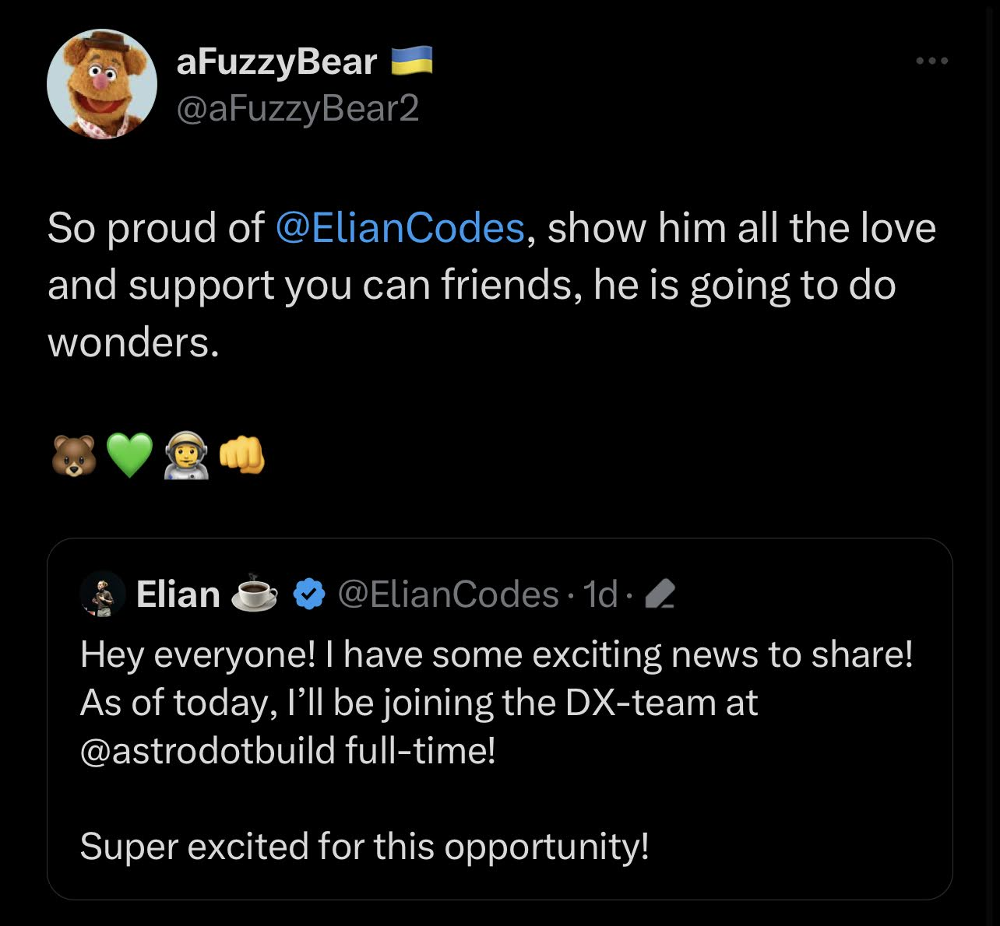

## Shipping Astro 3

*August*

I only had joined the Astro Core team about a week, before they came with the announcement: “We’re shipping Astro 3 and hey, Elian, You’re a big part of it. You’re responsible for writing the docs together with Sarah!”. Which is awesome, don't get me wrong. But it was also a bit overwhelming. I was still learning the ropes of the company and the project, and now I had to make sure the docs were up to date and ready for the release of Astro 3. It was a lot of work, but I’m glad I got to do it. It was such a great learning experience, working together with the whole DX team to make sure the docs were in shape and working with the platform team on what features were going to be released and how to document them.

## Starting devs.gent

*September*

I always had this in mind. Since day one I attended and joined meetups. How awesome is it to empower people to take the stage and make their 20 minutes of fame? If I can help them, I'll gladly do so. Thanks to Freek and Bert, that dream was turned into a reality. Since we started, we have done 3 meetups, all of which were super successful! We always reached full capacity, with awesome conversations and great talks! Many thanks to all of the people who came to watch, give a talk, or hosted us at their company offices!

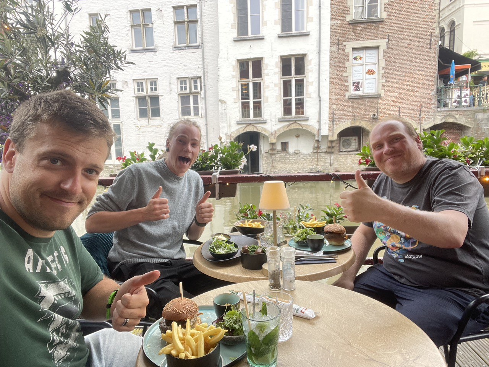

## Astro docs Raycast extension

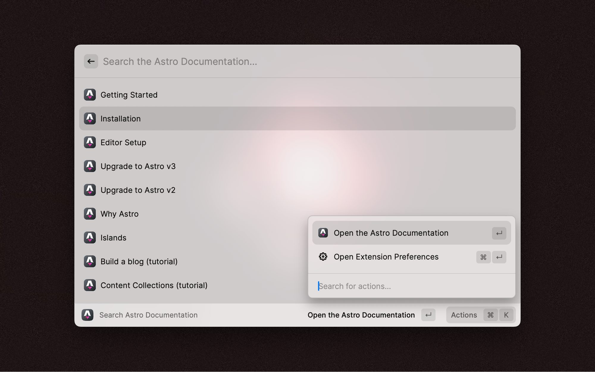

## community.astro.build

My first real *own* project inside the Astro Project. Super happy I got this chance to help grow our community and showcase all the amazing work each contributor has been doing. This website is only the start of something bigger and I'm sure we'll do something more with it this coming year.

## BeJS podcast

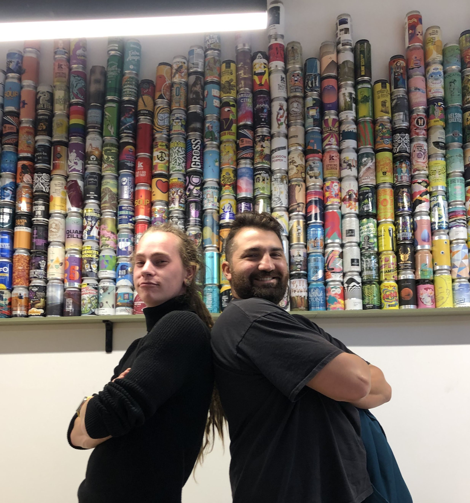

## Shipping Astro 4

## Goals for 2024

### Astro Studio

I’ve been working with Astro Studio for about a month now and I can say that I’m super excited about its public launch and how the general public will receive it. One thing is clear to me, there was a lot of effort and love put into this project and product.

### conferences

Since I’m now working at Astro full-time, I feel like I have less time for conferences, but also I still want to keep doing them. One of the dreams I have is to speak at a conference on every continent in the world! For now, that still leaves Asia, Africa, and North- and South America. So, conference organizers, you know what to do!

### Workshops

Next to conferences, I want to give a workshop this year! I think it's a great learning experience, for both myself and attendees. Attendees get to play around with Astro for a couple of hours (which is always fun of course), but I, get to see where they run into problems, see their thought process, and how they want the framework to behave.

So here as well, conference organizers, you know what to do!

### Outputting more content

Since last year, I’ve done my fair share of conferences, but one thing I noted is that next to that, I don’t output a lot of content. So starting in 2024, I would like to work on that. Maybe it comes in the form of live streams on Twitch, or maybe it comes in the form of written blog posts, much like this one. I think that’s up to me to figure that one out!

### Be more involved in Astro Core / its future

Even though I’ve been working at Astro, over the past 6 months, I’ve kept myself a bit on the background of Astro Core, if it comes down to participating in RFCs and deciding the future of Astro. I’ve worked with Astro since v0.19 or something, but I never felt that I could really participate in improving Astro’s future. In 2024, I would like to change that a bit and be more active in the parts of Astro that I normally don’t really touch.

### Getting a Drivers license

Yep, I know. It sounds a bit stupid, but still, in 2024 I really want to get it over with. I never needed to go somewhere by car, since I live in a city. I still don't, but it's nice to have the freedom to go somewhere by car if I want to.

### Big thanks for making my year worth so much

- The vBridge Team
- aFuzzybear
- Daniel Roe & Debbie O’Brian
- Tejas & Atila
- Daniel Afonso & Josh Goldberg
- The RenderATL peeps, you know who you are!
- Fred & Sarah, because of obvious reasons
- Sylwia, for giving me the final push in Copenhagen I needed so bad
- Rachel Nabors
- The whole Astro team
- Bert & Freek
- The StoryBlok team (especially Alexandra, Alvaro, Will and Alba)
- Aymen & Omar
- Probably so much more that I’m forgetting here!

Probably, most of these people, never known they meant so much in my career and overall life. But be sure, they are the reason I’m doing what I’m doing today. Each and every one of them inspired me, empowered me, to become the person that I am today.

Thanks for that. I appreciate you.
